# Basic Automatic Speech Recognition (ASR) and Text-to-Speech (TTS)

## Overview

This repository documents a learning journey of ASR and TTS experiments on Myanmar speech (OpenSLR80). ASR notebooks fine-tune Wav2Vec2 end to end. TTS notebooks train custom Transformer models (autoregressive stacks with guided attention and neural vocoders, and a non-autoregressive FastSpeech2-style path with forced durations) then evaluate with listening checks, attention maps, and mel-error plots.

## Experiments

### Summary
 
ASR fine-tuning produces usable Myanmar transcriptions (WER ≈ 58%, CER ≈ 13%). TTS remains unsolved: both the autoregressive (guided-attention) and non-autoregressive (duration-based) Transformers still synthesize wind-like noise rather than speech, even when training loss looks healthy (AR ≈ 0.2) or stays higher (NAR ≈ 1+). Among vocoders tried on these mels, Griffin-Lim is the most reliable, HiFi-GAN is next, and WaveGlow collapses to pure wind / hiss with no speech-like tone at all.

### ASR Results

| Config | Training Results | Error Analysis |
|--------|------------------|----------------|
| Data capped at 2000 before split | 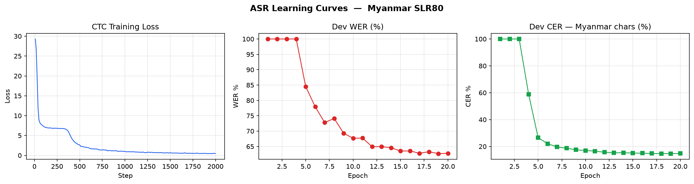 | <table><thead><tr><th>Error Type</th><th>Tool</th><th>Percentage</th></tr></thead><tbody><tr><td>WER</td><td>Python</td><td>58.30%</td></tr><tr><td>WER</td><td><code>sclite</code></td><td>58.30%</td></tr><tr><td>CER</td><td>Python</td><td>13.69%</td></tr><tr><td>CER</td><td><code>sclite</code></td><td>12.80%</td></tr></tbody></table> |

### TTS Results

| Experiment | Config | TTS Spectrogram Synthesis Test | Error Analysis | 
|------------|--------|----------|-----------------------------------|
| v6_exp_1.0 | `--ga_weight` 1.0<br>`--ga_g` 0.2<br>`--ss_max_prob` 0.5 | 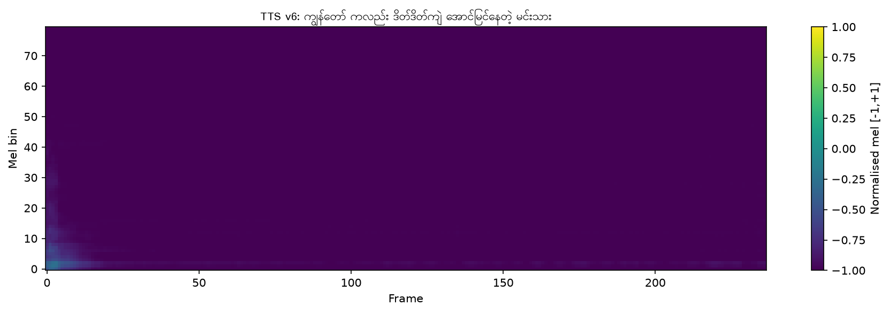 | 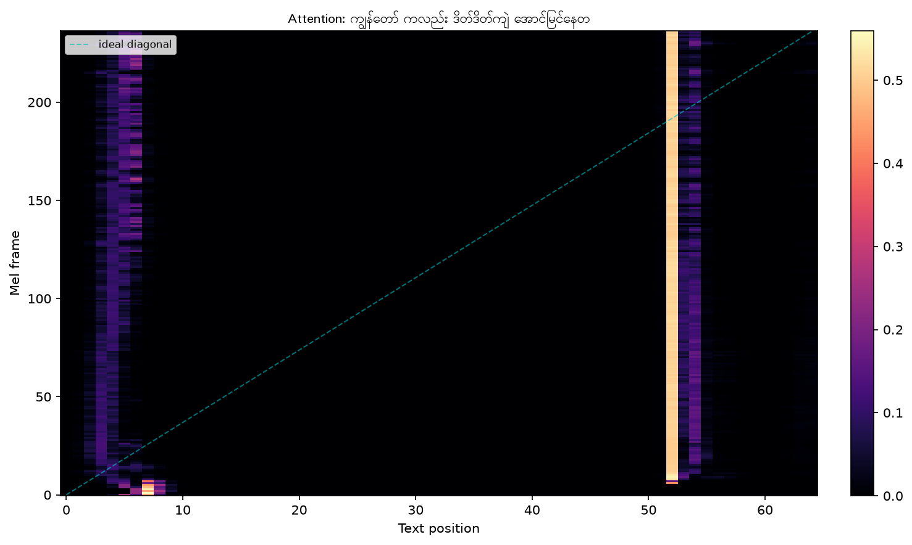 |
| v6_exp_1.1 | `--ga_weight` 3.0<br>`--ga_g` 0.15<br>`--ss_max_prob` 0.8 | 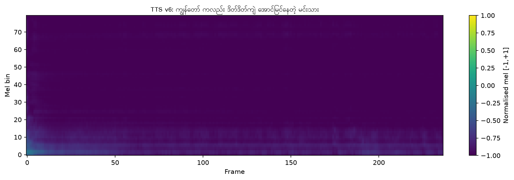 | 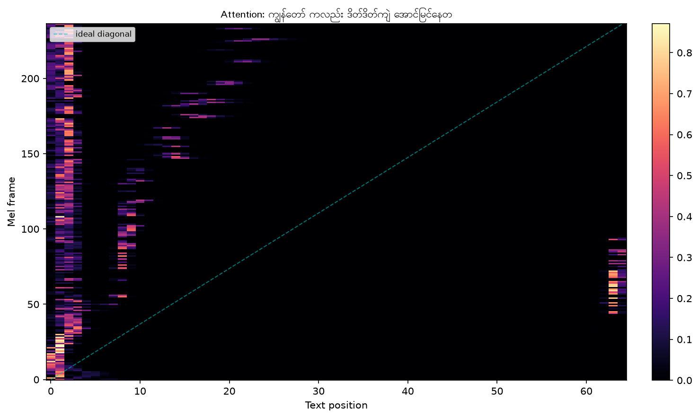 |
| v6_exp_1.2 | `--ga_weight` 5.0<br>`--ga_g` 0.1<br>`--ss_max_prob` 0.8 | 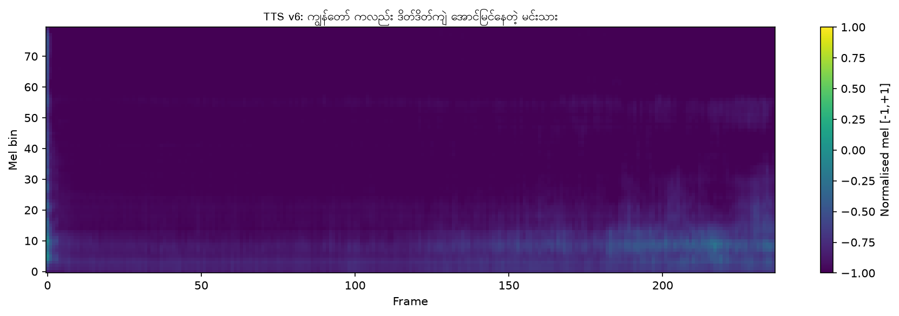 | 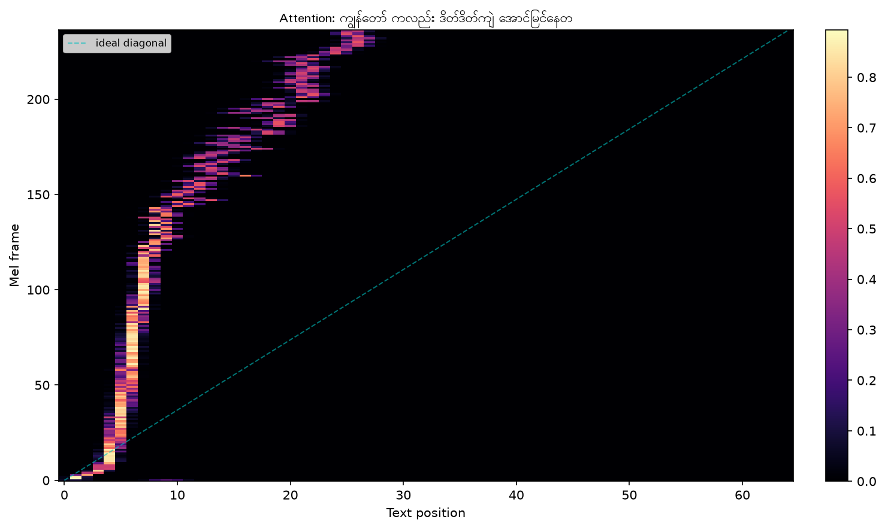 |
| v6_exp_1.3 | `--ga_weight` 8.0<br>`--ga_g` 0.08<br>`--ss_max_prob` 0.8 | 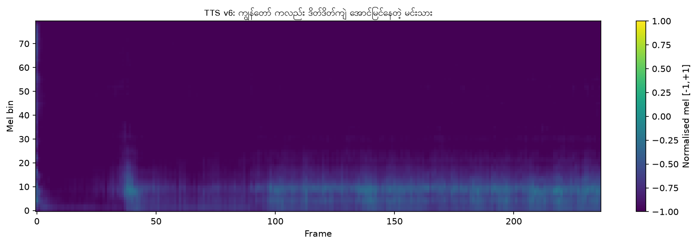 | 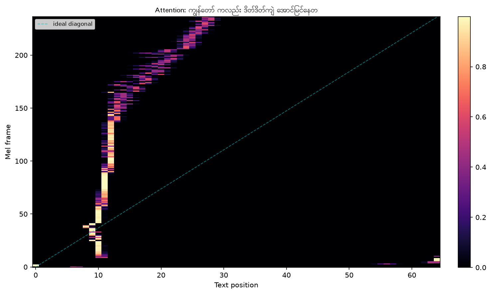 |
| NAR v1.0 | `--dur_loss_weight` 1.0 | UNDOCUMENTED | - |
| NAR v2.0 | `--dur_loss_weight` 1.0<br>`get_real_duarations.py`<br>`--epochs` 50 | 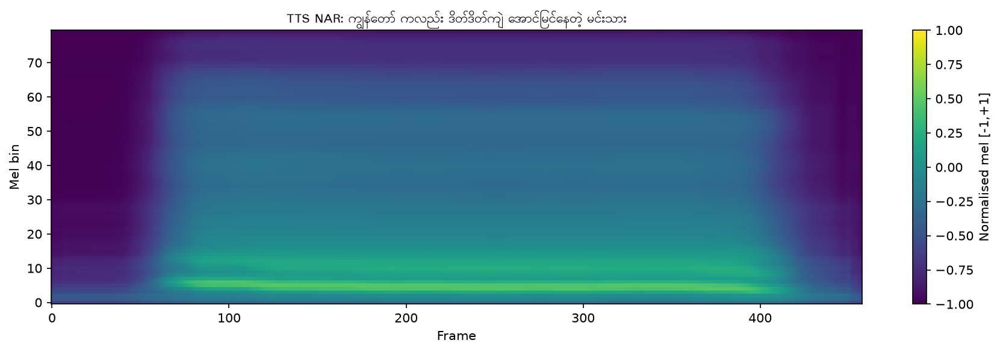 | 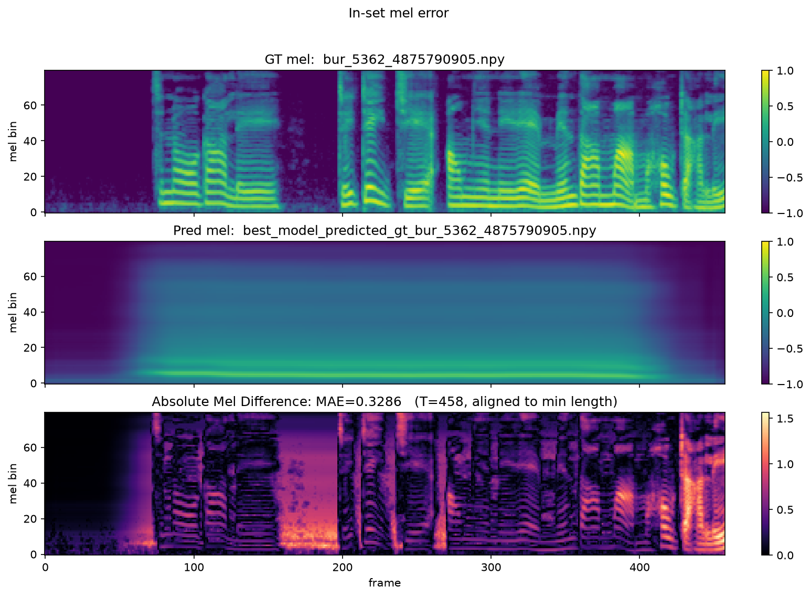 |
| NAR v2.0 | `--dur_loss_weight` 1.0<br>`get_real_duarations.py`<br>`--epochs` 150 | 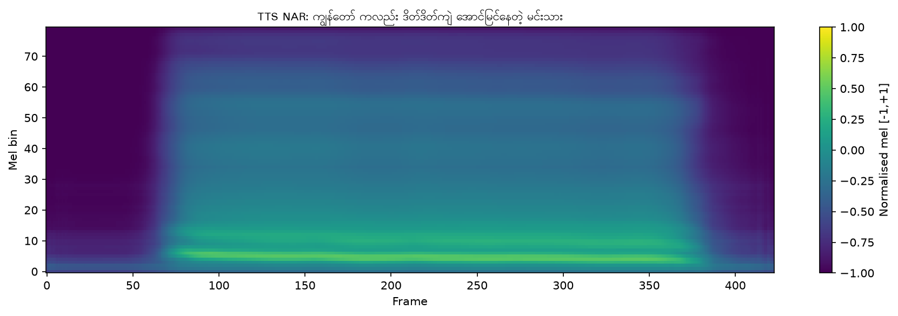 | 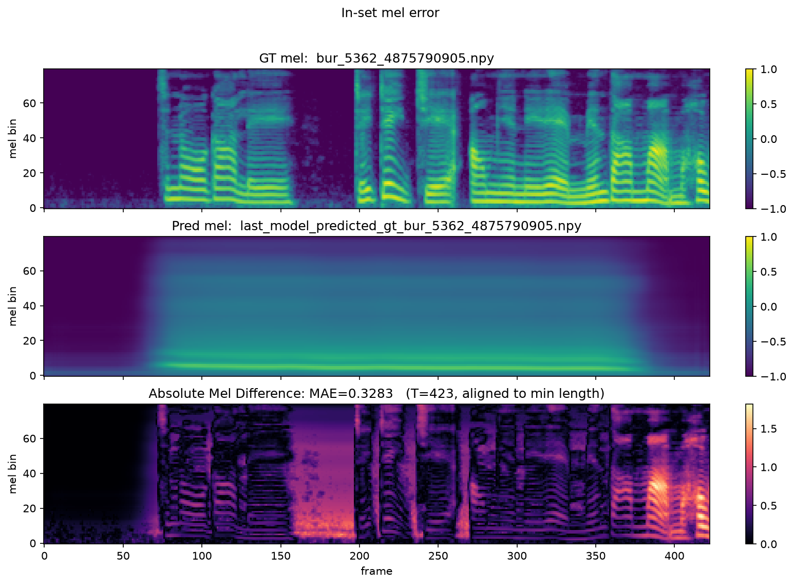 |

## Dataset

- [SLR80 Burmese Speech Dataset](https://www.openslr.org/80/)

## Tools

### Models

- **ASR**: [`facebook/wav2vec2-base`](https://huggingface.co/facebook/wav2vec2-base) (Wav2Vec2 CTC fine-tuning on SLR80)
- **TTS (AR)**: custom TransformerTTS with guided attention and scheduled sampling (`myanmar_tts_transformer_v6.py`)
- **TTS (NAR)**: custom FastSpeech2-style encoder + duration predictor + length regulator (`myanmar_tts_transformer_nar.py`)
- **Duration alignment (NAR)**: [`facebook/mms-1b-all`](https://huggingface.co/facebook/mms-1b-all) Burmese (`mya`) CTC adapter via `get_real_durations.py`

### Vocoders

- **HiFi-GAN**: NVIDIA `torch.hub` (`nvidia_hifigan`)
- **WaveGlow**: NVIDIA `torch.hub` (`nvidia_waveglow`)
- **Griffin-Lim**: classical mel to wav fallback (`--vocoder griffin_lim` / `--no_neural_vocoder`)

### Evaluation

- **ASR WER / CER (Python):** in-notebook edit-distance scoring on reference vs hypothesis
- **ASR WER / CER (SCTK):** [`sclite`](https://github.com/usnistgov/SCTK) from NIST SCTK (Docker `sctk` image); outputs `.pra` / `.dtl` under `asr_output/`
- **TTS diagnostics:** mel spectrogram plots, cross-attention heatmaps (AR), mel absolute-error plots (`src/plot.py`), listening checks of synthesized wavs
- **Audio utilities:** Praat and SoX usage examples (`praat_usage_example`, `sox_usage_example`)

## File Structure
```
/
...
├── scripts/                # originally Sayar's
├── src/                    # originally Sayar's
├── tutorial_notebooks/     # originally Sayar's
│
├── praat_usage_example     # Praat tool example
├── sox_usage_example       # SoX tool example
│
├── asr_output/                              # results of ASR experiment(s)
│   ├── ...
│   ├── error_{ref,hyp}_id.{word,char}.pra   # pra file
│   └── error_{ref,hyp}_id.{word,char}.dtl   # dtl file
├── tts_output/                              # results of TTS experiment(s)
│   ├── ...
│   ├── v6_exp_1.0/
│   └── v6_exp_1.1/
│
├── asr_wav2vec2_slr80_v1.0.ipynb
├── tts_transformer_slr80_v1.0.ipynb
├── tts_transformer_slr80_v1.1.ipynb
├── tts_transformer_slr80_v1.2.ipynb
├── tts_transformer_slr80_v1.3.ipynb
└── tts_transformer_slr80_nar2.0.ipynb
```

## References

- [In-Class Tutorial](https://github.com/ye-kyaw-thu/AIE-F/tree/main/slide-code/class-29)

## Note

This project was done for educational purposes as an assignment for the AI Engineering Fundamentals class taught by [*Sayar Ye Kyaw Thu*](https://github.com/ye-kyaw-thu).
