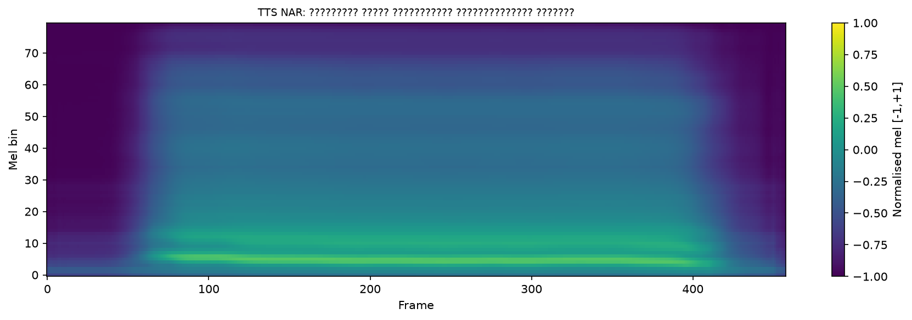

# Basic Automatic Speech Recognition (ASR) and Text-to-Speech (TTS)

## Overview

My ASR and TTS learning journey

## Experiments

TTS Results:

| Experiment | Config | TTS Spectrogram Synthesis Test | Cross-Attention Alignment Heatmap | 
|------------|--------|----------|-----------------------------------|
| v6_exp_1.0 | `--ga_weight` 1.0<br>`--ga_g` 0.2<br>`--ss_max_prob` 0.5 |  |  |
| v6_exp_1.1 | `--ga_weight` 3.0<br>`--ga_g` 0.15<br>`--ss_max_prob` 0.8 |  |  |
| v6_exp_1.2 | `--ga_weight` 5.0<br>`--ga_g` 0.1<br>`--ss_max_prob` 0.8 |  |  |
| v6_exp_1.3 | `--ga_weight` 8.0<br>`--ga_g` 0.08<br>`--ss_max_prob` 0.8 |  |  |
| NAR v1.0 | `--dur_loss_weight` 1.0 | UNDOCUMENTED | - |
| NAR v2.0 | `--dur_loss_weight` 1.0<br>`get_real_duarations.py` |  | - |

## Dataset

- [SLR80 Burmese Speech Dataset](https://www.openslr.org/80/)

## File Structure
```
/
...
├── scripts/                # originally Sayar's
├── src/                    # originally Sayar's
├── tutorial_notebooks/     # originally Sayar's
│
├── praat_usage_example     # Praat tool example
├── sox_usage_example       # SoX tool example
│
├── asr_output/                              # results of ASR experiment(s)
│   ├── ...
│   ├── error_{ref,hyp}_id.{word,char}.pra   # pra file
│   └── error_{ref,hyp}_id.{word,char}.dtl   # dtl file
├── tts_output/                              # results of TTS experiment(s)
│   ├── ...
│   ├── v6_exp_1.0/
│   └── v6_exp_1.1/
│
├── asr_wav2vec2_slr80_v1.0.ipynb
├── tts_transformer_slr80_v1.0.ipynb
├── tts_transformer_slr80_v1.1.ipynb
├── tts_transformer_slr80_v1.2.ipynb
├── tts_transformer_slr80_v1.3.ipynb
└── tts_transformer_slr80_nar2.0.ipynb
```

## References

- [In-Class Tutorial](https://github.com/ye-kyaw-thu/AIE-F/tree/main/slide-code/class-29)

## Note

This project was done for educational purposes as an assignment for the AI Engineering Fundamentals class taught by [*Sayar Ye Kyaw Thu*](https://github.com/ye-kyaw-thu).
